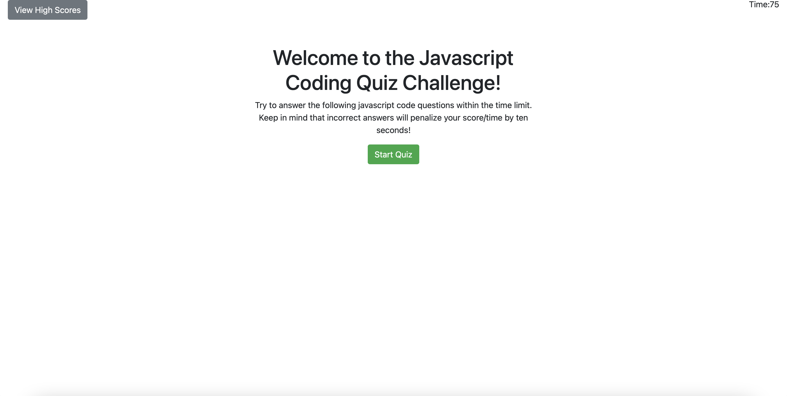

# Code Quiz

## Description
This app gives the user a quiz about coding.

The user has 75 seconds to complete the quiz and takes a time penalty for incorrect anwers.

After the quiz has been completed a score is assigned based on the time remaining.

The user is then prompted to enter their initials to the scoreboard which is saved locally. This scoreboard can be cleared by the user.

## Screenshot 

## Contact Me
- Email: adamdvaughn@gmail.com
- Github: [adamvaughn](https://github.com/adamvaughn)